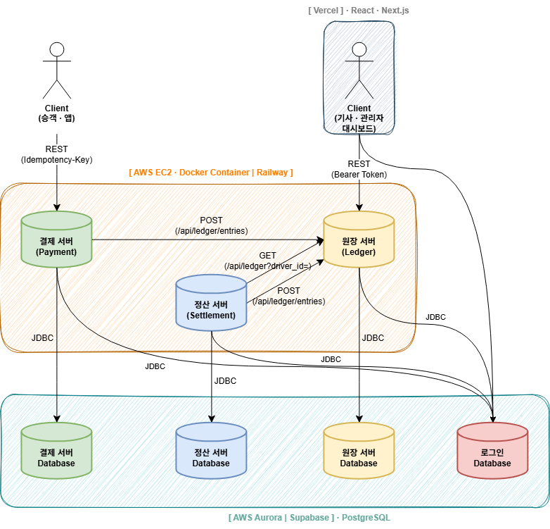

# 🏗️ 시스템 아키텍처

> 아키텍처에 관해 다른 문서와 내용이 다르면 **이 문서가 맞다.**
> [기획서](../01-planning/service-spec.md) §4는 단일 서버 전제로 쓰여 현행이 아니다.

---

## 1. 전체 구성



서버 3개가 각자 DB를 하나씩 갖고, 서로는 REST로만 통신한다.

| 서비스 | 담당자 | 책임 | 레포 |
|---|---|---|---|
| 결제 (payment) | 김주엽 | 결제 청구, 멱등 처리, 취소·환불 | [driver-payment-system](https://github.com/Easy-ADJ/driver-payment-system) |
| 원장 (ledger) | 이치헌 | 분개 기록, 미지급금 계산, 정합성 검증 | [driver-ledger-system](https://github.com/Easy-ADJ/driver-ledger-system) |
| 정산 (settlement) | 허진수 | 일 단위 집계 배치, 대사 | [driver-settlement-system](https://github.com/Easy-ADJ/driver-settlement-system) |

### 서버 간 호출

| 호출자 | 피호출자 | 엔드포인트 | 용도 |
|---|---|---|---|
| 결제 | 원장 | `POST /api/ledger/entries` | 결제 승인·취소 분개 기록 |
| 정산 | 원장 | `GET /api/ledger/unpaid?date=` | 배치 대상 선별 (미지급 기사 목록) |
| 정산 | 원장 | `GET /api/ledger?driver_id=` | 미지급금 합계 + 결제 건별 근거 |
| 정산 | 원장 | `POST /api/ledger/entries` | 정산 확정 시 지급 분개 기록 |
| 정산 | 결제 | `GET /api/payments?date=` | 대사 교차검증 |

- 통신은 전부 **동기 REST**다. 실패 처리 규약은 [service-contracts.md](./service-contracts.md) 참고.
- 호출 주소는 환경변수로 주입한다. 하드코딩 금지.
- **원장은 아무도 호출하지 않는다.** 결제·정산 둘 다 원장에 의존하므로 원장 API가 가장 먼저 확정돼야 한다.

> **운임 합계의 출처는 결제가 아니라 원장이다.**
> 원장이 기사별 결제 합계(미지급금)를 들고 있고, 정산은 거기서 수수료 20%를 뺀다.
> 결제 서버는 대사에서만 부른다 — 원장에서 받은 값을 원장과 비교하면 검증이 되지 않기 때문이다.

### 클라이언트

| 클라이언트 | 대상 | 인증 |
|---|---|---|
| 승객 앱 | 결제 서버 | `Idempotency-Key` 헤더 |
| 기사·관리자 대시보드 | 원장 서버, 로그인 DB(직접 접속) | `Bearer Token` |

- **React · TypeScript · Next.js · shadcn/ui · Tailwind CSS**, Vercel 배포. 로그인·회원가입은 Next.js에서 구현한다.
- 화면은 관리자용과 기사용을 따로 만든다.
- **대시보드는 정산 서버를 호출하지 않는다.** 필요해지면 그때 `GET /api/settlements`를 연결한다.

### 데이터베이스

**DB 인스턴스는 총 4개다** — 서비스마다 하나씩, 여기에 로그인 DB를 더한다.
각 서버는 자기 DB와 로그인 DB, 두 곳에 접속한다.

| DB | 접속 주체 | 담긴 테이블 |
|---|---|---|
| 결제 DB | 결제 서버 | `PAYMENT_ATTEMPT`, `PAYMENT`, `MONEY` |
| 원장 DB | 원장 서버 | `LEDGER_ENTRIES` |
| 정산 DB | 정산 서버 | `BATCHES`, `SETTLEMENTS` (+ Spring Batch 메타) |
| 로그인 DB | 세 서버 전부 + 대시보드 | `MANAGER_ACCOUNTS`, `DRIVER_ACCOUNTS` |

- 로그인 DB는 **기사 정보(이름·계좌번호)의 공유 참조처**다. 세 서버는 자기 테이블에 `driver_id`만 갖고 있어 나머지는 여기서 읽는다.
- 별도 인스턴스이므로 **JOIN도 FK도 불가능**하다. 세 서버 모두 DataSource를 2개 두고 결과를 애플리케이션에서 합친다. ([erd.md §4](./erd.md#4-서비스-경계를-넘는-참조))
- 보호 방식: 클라이언트는 **Supabase RLS + anon key**, 서버는 **서버별 읽기 전용 계정**(`payment_ro`·`ledger_ro`·`settlement_ro`).
- ⚠️ 로그인 DB는 **단일 장애점**이다. 여기가 내려가면 세 서버가 동시에 기사 정보를 잃는다.

컬럼 상세는 [ERD 문서](./erd.md) 참고.

---

## 2. 왜 이렇게 나눴나

**서비스를 3개로 나눈 이유** — 팀원 3명이 서로를 기다리지 않고 병렬 개발하기 위해서다. 도메인 경계가 기능 명세 단위와 일치해 책임이 겹치지 않는다.

**DB까지 나눈 이유** — DB를 공유하면 서비스 경계가 규칙으로만 존재한다. 남의 테이블을 조인해도 아무도 막지 않는다. DB를 나누면 그 경계가 **물리적으로 강제된다.**

**대신 치르는 대가** — 결제와 원장을 하나의 트랜잭션으로 묶을 수 없고(3절), 경계를 넘는 FK를 걸 수 없다.

**로그인 DB만 공유하는 이유** — 세 서버 모두 `driver_id`만 갖고 있어 기사 이름·계좌번호를 아무도 모른다. 앞에 계정 API 서버를 세우는 것이 원칙에 맞지만 네 번째 서버와 담당자가 필요하다. 팀이 3명이고 기사 정보는 읽기 전용 참조 데이터라 직접 접속을 택했다.

> 이것은 **원칙의 예외이지 원칙의 변경이 아니다.** 업무 테이블(결제·원장·정산)의 경계는 그대로 API로만 넘는다.

---

## 3. 결제와 원장의 원자성

DB가 나뉘어 결제와 원장을 하나의 트랜잭션으로 묶을 수 없다. 그래서 남는 문제는 하나다 — **결제는 성공했는데 원장 기록이 실패하면 어떻게 하는가?**

**확정: 재시도 후에도 실패하면 결제도 실패 처리한다.**

```
결제 승인
   │
   ▼
POST /api/ledger/entries ──성공──▶ 결제 완료
   │
   ├─ 5xx·타임아웃 ─▶ 지수 백오프로 2회 재시도
   │                        ├─ 성공 ─▶ 결제 완료
   │                        └─ 실패 ─▶ 결제도 롤백
   │
   └─ 4xx ─────────▶ 재시도 없이 즉시 실패
```

- 원장이 미지급금을 들고 있고 정산이 그 값을 쓰므로, **원장에서 누락되면 정산 금액이 곧바로 틀린다.**
- 재시도가 실제로 일어나므로 **원장 API의 멱등성이 필수**다. `LEDGER_ENTRIES.idempotency_key` UNIQUE로 보장한다.
- 대가는 원장이 길게 죽으면 결제가 전부 실패한다는 것이다. **결제 가용성보다 금액 정합성을 택했다.**

---

## 4. 서비스 경계

경계를 넘는 데이터는 전부 API를 거친다. **로그인 DB만 예외다.**

| 필요한 것 | 가져오는 방법 |
|---|---|
| 결제가 분개를 기록 | 원장 `POST /api/ledger/entries` |
| 정산이 대상 기사를 선별 | 원장 `GET /api/ledger/unpaid?date=` |
| 정산이 금액과 근거를 조회 | 원장 `GET /api/ledger?driver_id=` |
| 정산이 지급 분개를 기록 | 원장 `POST /api/ledger/entries` |
| 정산이 대사로 교차검증 | 결제 `GET /api/payments?date=` |
| 세 서버가 기사 이름·계좌번호 조회 | ⚠️ 로그인 DB에 직접 SELECT — 유일한 예외 |

**위험의 성격이 바뀌었다.** 결합점이 테이블에서 API 계약으로 옮겨갔다.

- 상대 API의 응답 필드가 바뀌면 **컴파일 에러 없이 조용히** 틀린 값을 받는다.
- 상대 서버가 죽으면 내 기능도 멈춘다. 타임아웃·재시도 규약이 필요한 이유다.

계약 변경 절차는 [service-contracts.md §3](./service-contracts.md#3-계약-변경-절차)에 있다.

---

## 5. 인프라

| 요소 | 선택 |
|---|---|
| DB | **Supabase** (PostgreSQL) — DB 4개 |
| DB 연결 | **Supavisor session 모드** |
| 스키마 관리 | **Flyway** — DB마다 독립 버전 |
| 애플리케이션 | Spring Boot 4 / Java 17 |
| 정산 배치 | Spring Batch (정산 서버 내부) |
| 배치 스케줄링 | `@Scheduled` + 수동 실행 API |
| 배포 위치 | **Railway** — 서비스별 인스턴스 분리, git push 배포 |
| 클라이언트 | React · TypeScript · Next.js · shadcn/ui · Tailwind CSS |
| 클라이언트 배포 | **Vercel** |
| 정산 리포트 | 이번 범위 제외 — 조회 API로 대체 |

- 가상 스레드(`spring.threads.virtual.enabled=true`)를 3개 서비스 모두에 적용한다. 서버 간 동기 호출이 많아 I/O 대기가 길다.

> ⚠️ **Supabase·Railway는 잠정 선택이다.** AWS 계정 지급이 지연돼 개발을 멈추지 않으려고 택했다.
> 계정이 나오면 옮길지 다시 판단하므로 **제품에 종속되는 코드를 쓰지 않는다** — 접속 정보는 환경변수, 스키마는 Flyway로 관리한다.

> ⚠️ **Railway는 유휴 시 인스턴스가 잠들 수 있다.** 첫 호출이 느려서 타임아웃을 연결 5초 / 응답 10초로 잡았다.
> 데모 직전에 세 서버를 한 번씩 깨워둔다.

---

## 관련 문서

- 호출 계약과 공통 규약: [service-contracts.md](./service-contracts.md)
- 테이블 구조: [erd.md](./erd.md)
- 서버별 API: [payment](./services/payment.md) · [ledger](./services/ledger.md) · [settlement](./services/settlement.md)
