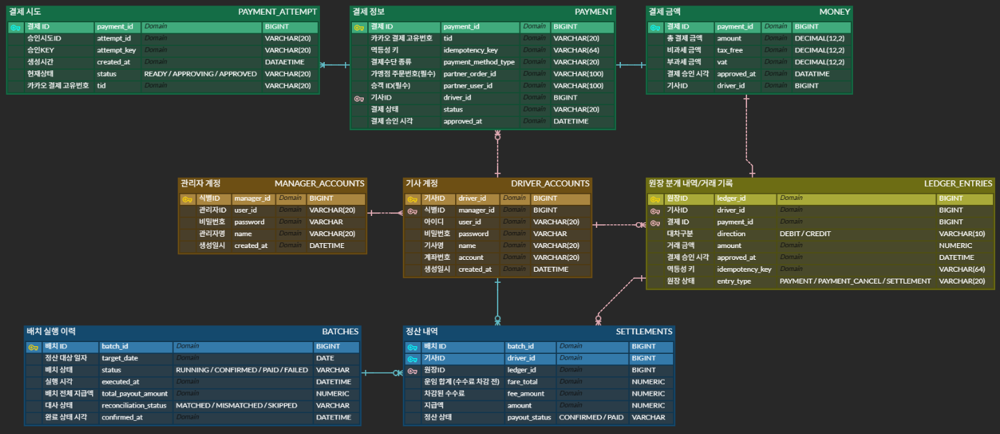

# 📐 ERD 및 테이블 소유권

> 다이어그램: [Team ERDCloud](https://www.erdcloud.com/team/xyiBeZRo9gEJPk2WZ)

---

## 1. DB 구성

DB 인스턴스는 총 4개다. 서비스마다 하나씩, 여기에 로그인 DB를 더한다.

| DB | 소유자 | 접속하는 주체 | 담긴 테이블 |
|---|---|---|---|
| 결제 DB | 김주엽 | 결제 서버 | `PAYMENT_ATTEMPT`, `PAYMENT`, `MONEY` |
| 원장 DB | 이치헌 | 원장 서버 | `LEDGER_ENTRIES` |
| 정산 DB | 허진수 | 정산 서버 | `BATCHES`, `SETTLEMENTS` (+ Spring Batch 메타) |
| 로그인 DB | 허진수 | 세 서버 전부 + 대시보드 | `MANAGER_ACCOUNTS`, `DRIVER_ACCOUNTS` |

DB를 나눴으므로 **업무 테이블의 소유권은 DB 경계로 강제된다.** 결제·원장·정산 DB에는 소유 서버 하나만 붙고, 경계를 넘는 데이터는 API를 거친다. ([접근 규칙](./service-contracts.md#0-테이블-직접-접근-금지))

**로그인 DB만 예외다.** 기사 이름·계좌번호를 네 곳이 각자 읽어가는 공유 참조 DB이기 때문이다.

- ⚠️ 접속이 열린 것이지 같은 DB가 된 것은 아니다. 별도 인스턴스라 **JOIN도 FK도 불가능**하다. ([4절](#4-서비스-경계를-넘는-참조))
- ⚠️ 계정·비밀번호가 든 유일한 DB인데 접속 주체가 4곳이다. 보호 방식은 **RLS + anon key**(클라이언트), **서버별 읽기 전용 계정**(서버).
- ⚠️ **단일 장애점이다.** 여기가 내려가면 세 서버가 동시에 기사 정보를 잃는다.

DB 제품은 **Supabase**이며, 접속 설정은 [dev-environment.md](../03-development/dev-environment.md) 참고.

---

## 2. 테이블 상세

**소유자 = 그 테이블의 스키마를 변경할 수 있는 유일한 사람.**
DB가 나뉘어 물리적 사고는 막히지만, 스키마 변경은 그 테이블을 읽는 상대의 API 응답을 바꾼다.

### 결제 DB — 김주엽

`PAYMENT_ATTEMPT` — 결제 시도

| 컬럼 | 타입 | 설명 |
|---|---|---|
| `payment_id` | BIGINT | PK |
| `attempt_id` | VARCHAR(20) | 승인 시도 ID |
| `attempt_key` | VARCHAR(20) | 승인 KEY |
| `created_at` | DATETIME | 생성 시간 |
| `status` | VARCHAR(20) | `READY` / `APPROVING` / `APPROVED` |
| `tid` | VARCHAR(20) | 카카오 결제 고유번호 |

`PAYMENT` — 결제 정보

| 컬럼 | 타입 | 설명 |
|---|---|---|
| `payment_id` | BIGINT | PK |
| `tid` | VARCHAR(20) | 카카오 결제 고유번호 |
| `idempotency_key` | VARCHAR(64) | **멱등성 키 — UNIQUE** |
| `payment_method_type` | VARCHAR(20) | 결제수단 종류 |
| `partner_order_id` | VARCHAR(100) | 가맹점 주문번호 |
| `partner_user_id` | VARCHAR(100) | 승객 ID |
| `driver_id` | BIGINT | 기사 ID (로그인 DB 소유, FK 불가) |
| `status` | VARCHAR(20) | 결제 상태 |
| `approved_at` | DATETIME | 승인 시각 |

`MONEY` — 결제 금액

| 컬럼 | 타입 | 설명 |
|---|---|---|
| `payment_id` | BIGINT | PK · FK |
| `amount` | DECIMAL(12,2) | 총 결제 금액 |
| `tax_free` | DECIMAL(12,2) | 비과세 금액 |
| `vat` | DECIMAL(12,2) | 부가세 금액 |
| `approved_at` | DATETIME | 승인 시각 |
| `driver_id` | BIGINT | 기사 ID |

### 원장 DB — 이치헌

`LEDGER_ENTRIES` — 분개 내역

| 컬럼 | 타입 | 설명 |
|---|---|---|
| `ledger_id` | BIGINT | PK |
| `driver_id` | BIGINT | 기사 ID (로그인 DB 소유, FK 불가) |
| `payment_id` | BIGINT | 결제 ID (결제 DB 소유, FK 불가). 지급 분개에는 **NULL** |
| `idempotency_key` | VARCHAR(64) | **멱등성 키 — UNIQUE** |
| `entry_type` | VARCHAR(20) | `PAYMENT` / `PAYMENT_CANCEL` / `SETTLEMENT` |
| `direction` | VARCHAR(10) | `DEBIT` / `CREDIT` |
| `amount` | NUMERIC | 거래 금액 |
| `approved_at` | DATETIME | 승인 시각 |

### 정산 DB — 허진수

`BATCHES` — 배치 실행 이력

| 컬럼 | 타입 | 설명 |
|---|---|---|
| `batch_id` | BIGINT | PK |
| `target_date` | DATE | 정산 대상 일자 |
| `status` | VARCHAR | `RUNNING` / `CONFIRMED` / `PAID` / `FAILED` |
| `executed_at` | DATETIME | 실행 시각 |
| `total_payout_amount` | NUMERIC | 배치 전체 지급액 |
| `reconciliation_status` | VARCHAR | `MATCHED` / `MISMATCHED` / `SKIPPED` |
| `confirmed_at` | DATETIME | 확정 시각 |

`SETTLEMENTS` — 정산 내역

| 컬럼 | 타입 | 설명 |
|---|---|---|
| `batch_id` | BIGINT | PK · FK |
| `driver_id` | BIGINT | PK — 기사 ID |
| `ledger_id` | BIGINT | **지급 상쇄 분개**의 원장 ID (원장 DB 소유, FK 불가). 분개 기록 전에는 **NULL** |
| `fare_total` | NUMERIC | 운임 합계 (수수료 차감 전) |
| `fee_amount` | NUMERIC | 차감된 수수료 |
| `amount` | NUMERIC | 지급액 |
| `payout_status` | VARCHAR | `CONFIRMED` / `PAID` |

> `ledger_id`가 `NULL`이면 **아직 지급 분개를 남기지 않았다**는 뜻이다(`CONFIRMED` 직후).
> 값이 있으면 원장에 상쇄 분개가 기록됐다. 지급 분개 누락은 다음날 이중 정산으로 이어지므로,
> 이 컬럼 하나로 "원장에 반영됐는가"를 확인할 수 있게 둔다. 집계에 쓴 근거 분개는 여러 건이라
> 단일 컬럼에 담기지 않는다 — 그 답은 `GET /api/ledger?driver_id=` 응답이 준다.

> Spring Batch 메타 테이블(`BATCH_JOB_INSTANCE` 등)은 정산 DB에 함께 둔다.

### 로그인 DB — 허진수

`MANAGER_ACCOUNTS` — 관리자 계정

| 컬럼 | 타입 | 설명 |
|---|---|---|
| `manager_id` | BIGINT | PK |
| `user_id` | VARCHAR(20) | 관리자 ID |
| `password` | VARCHAR | 비밀번호 (해시) |
| `name` | VARCHAR(20) | 관리자명 |
| `created_at` | DATETIME | 생성일시 |

`DRIVER_ACCOUNTS` — 기사 계정

| 컬럼 | 타입 | 설명 |
|---|---|---|
| `driver_id` | BIGINT | PK |
| `manager_id` | BIGINT | FK — 소속 관리자 |
| `user_id` | VARCHAR(20) | 아이디 |
| `password` | VARCHAR | 비밀번호 (해시) |
| `name` | VARCHAR(20) | 기사명 |
| `account` | VARCHAR(20) | 계좌번호 |
| `created_at` | DATETIME | 생성일시 |

---

## 3. 주요 제약

| 테이블 | 제약 | 이유 |
|---|---|---|
| `PAYMENT` | `idempotency_key` UNIQUE | 동시 중복 결제 중 하나만 성공시킨다 |
| `LEDGER_ENTRIES` | `idempotency_key` UNIQUE | 결제의 재시도가 분개를 두 번 만들지 않게 막는다 |
| `LEDGER_ENTRIES` | 거래 단위 차변 합 = 대변 합 | 이중기입 정합성. **애플리케이션에서 검증**하고 위반 시 400 |
| `LEDGER_ENTRIES` | 수정·삭제 금지 (append-only) | 취소는 삭제가 아니라 **상쇄 분개 추가**로 처리 |
| `BATCHES` | `target_date` 중복 CONFIRMED 방지 | 배치 재실행 시 중복 집계 차단 |

> **핵심 원칙 — 잔액을 직접 갱신하지 않고 분개의 합으로 항상 재계산한다.**
> 그래야 잔액이 이상할 때 분개 이력을 replay해 원인을 추적할 수 있다.

차변=대변을 DB 트리거가 아니라 애플리케이션에서 검증하는 이유는, 거래 단위 합계가 행 단위 `CHECK`로는 불가능해 트리거가 필요한데 디버깅·테스트·마이그레이션이 모두 무거워지기 때문이다. DB가 나뉘어 원장 서버를 우회해 INSERT할 경로 자체가 없으므로 애플리케이션 검증으로 충분하다.

---

## 4. 서비스 경계를 넘는 참조

DB가 나뉘어 **경계를 넘는 FK는 걸 수 없다.** 상대 서비스의 식별자는 값으로만 보관한다.

| 보관하는 곳 | 값 | 원본 소유 |
|---|---|---|
| `LEDGER_ENTRIES.payment_id` | 결제 ID | 결제 DB |
| `LEDGER_ENTRIES.driver_id` | 기사 ID | 로그인 DB |
| `SETTLEMENTS.ledger_id` | 지급 상쇄 분개 ID | 원장 DB |
| `SETTLEMENTS.driver_id` | 기사 ID | 로그인 DB |
| `PAYMENT.driver_id` | 기사 ID | 로그인 DB |

- DB가 참조 무결성을 보장하지 않으므로 **존재하지 않는 ID가 섞여도 insert가 성공한다.**
- ERD 다이어그램은 이 관계를 선으로 잇고 있지만 실제 FK로는 구현되지 않는다.
- 이 불일치를 잡아내는 것이 정산의 **대사(reconciliation)** 다.

### ID만 갖고, 나머지는 API로 조회한다

JOIN이 있던 자리를 API 호출이 대신한다.

| 갖고 있는 값 | 필요한 데이터 | 호출 |
|---|---|---|
| `LEDGER_ENTRIES.payment_id` | 결제 상세 | 결제 `GET /api/payments/{id}` |
| `SETTLEMENTS.driver_id` | 미지급금과 근거 | 원장 `GET /api/ledger?driver_id=` |
| `driver_id` (세 DB 전부) | 기사 이름·계좌번호 | **로그인 DB에 직접 SELECT** (아래) |

- **조회 시점에 매번 부르고, 값을 복제해두지 않는다.** 베껴두면 원본이 바뀌었을 때 조용히 어긋난다.
- 예외는 정산 확정처럼 **그 시점 값을 동결해야 하는 경우**(`SETTLEMENTS.fare_total`·`amount`)다. 이때도 근거 ID를 함께 남긴다.
- FK가 없으므로 상대 서버의 **404가 곧 참조 무결성 위반**이다. DB가 알려주던 것을 이제 HTTP가 알려준다.

### `driver_id`만 규칙이 다르다

기사 정보의 원본은 `DRIVER_ACCOUNTS`인데 로그인 DB 앞에는 서버가 없다. 그래서 여기만 세 서버가 각자 JDBC로 직접 SELECT한다.

| 서버 | 무엇을 위해 |
|---|---|
| 결제 | `driver_id`가 실재하는 기사인지 확인 |
| 원장 | 분개를 기사 이름과 함께 표시 |
| 정산 | 지급에 필요한 계좌번호와 기사 이름 |

- **JOIN은 여전히 불가능하다.** 세 서버 모두 DataSource를 2개 두고 결과를 애플리케이션에서 합친다. 두 DB에 걸친 트랜잭션도 불가능하다. ([설정 예시](../03-development/dev-environment.md))
- ⚠️ **여기서만 결합의 성격이 다르다.** 다른 경계는 API 계약이 결합점이지만 로그인 DB는 **테이블 스키마가 직접 결합점**이다. `DRIVER_ACCOUNTS` 컬럼을 바꾸면 세 서버 쿼리가 한꺼번에 깨진다.
- 그래서 이 테이블은 **팀에서 파급이 가장 큰 스키마**다. 바꿀 때는 `schema` 이슈에 세 명 모두를 멘션한다.

---

## 5. 남은 항목

- [ ] `GET /api/ledger?driver_id=` 응답에 담길 결제 건별 내역 형태 (원장 ↔ 정산 합의)
- [ ] `DRIVER_ACCOUNTS.password` 제거 여부 — Supabase Auth로 옮기면 테이블에 둘 이유가 없다
- [ ] nullable · 기본값 · 인덱스 (배치의 날짜 범위 조회, 원장 미지급금 집계)
- [ ] 로그인 DB 장애 시 세 서버의 동작 (기사 정보 없이 진행 / 실패)

---

## 관련 문서

- 전체 구성: [architecture.md](./architecture.md)
- 접근 규칙: [service-contracts.md](./service-contracts.md)
